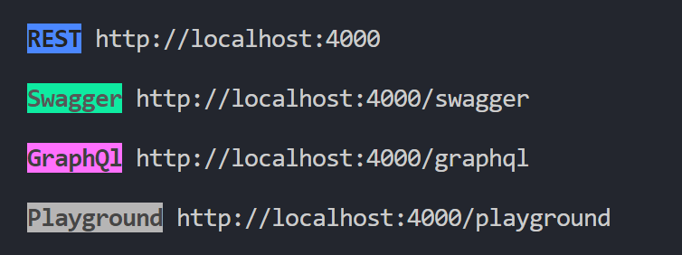

<h1 align='center'>
    MetaX
</h1>
<p align='center'>
    RESTfull & GraphQL API for your database</p>

<div align='center'>


</div>

## What does it introduce

**MetaX** introduces a _RESTFull_ and _GraphQL_ API that allows you to control your database through http requests programmatically, i.e creating tables and databases, adding columns and deleting columns, etc .



## Installation

- ### Download the binary

  You can download the binary from the [releases page](https://github.com/kareemmahlees/meta-x/releases).

  Make sure you add the executable to your `PATH` environment variable.

- ### Go Install

  You can use the `go install` command to install like so:

  ```shell
    go install github.com/kareemmahlees/mysql-meta
  ```

## Running

Once you [installed](#installation) the binary, _MetaX_ comes with subocommands to each you can supply your database connection parameters as command line flags.

You can find all about the commands by running with the `--help` flag:

```shell
meta-x --help
```

_MetaX_ by default serves on port `5522`, you can configure the port by passing the `--port` flag:

```shell
meta-x --port 4444
```

## Documentation

The API is fully documented, the REST version is documented using **Swagger Docs** and is served on `http://localhost:5522/swagger`

Regarding the GraphQL version, you can run the application and then use the GraphQL endpoint `http://localhost:5522/graphql` to introspect the schema with your favorite tool, e.g postman, insomnia, hoppscotch.

Additionally, you can playaround with the GraphQL version by jumping into the playground at `http://localhost:5522/playground`

## Progress Track

- Databases
  - [x] list databases
  - [x] create database
- Tables
  - [x] list tables
  - [x] table info
  - [x] create table
  - [x] delete table
  - [x] update table
- Queries
  - [ ] execute single query
  - [ ] execute multiple queries in transaction
- Views
  - [ ] list views
  - [ ] create views
  - [ ] delete views
  - [ ] query by views
- Config
  - [ ] get mysql version

## Contributing

We strongly encourage anyone who wants to contribute to go ahead, not matter what skill level your are.

Contributions can be as small as suggesting a feature, reporting a bug or enhancing the docs.

For more details, please visit [CONTRIBUTING.md]()
